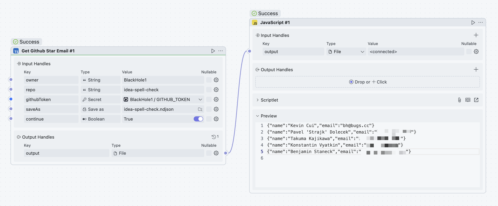

  <h1>Github Star Email</h1>
  

    
  

  

Get the email addresses of all users who starred the specified repository.

## Params Details

* `owner` - GitHub username
* `repo` - Project Name
* `githubToken` - Github Token
  1. Open https://github.com/settings/tokens/new
  2. Select `read:user` in `user`
* `saveAs` - Save location, file suffix is ndjson.
* `continue` - When set to `true`, it supports task recovery, allowing continuation from where it left off even after an interruption. The default value is `true`.
